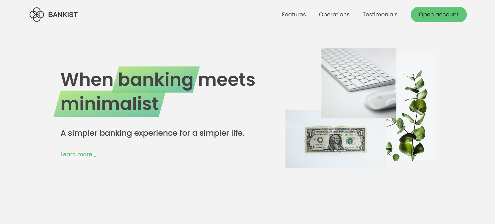

# Bankist Website — Modern Banking Landing Page

[🔗 Live Demo](https://stasiv-bankist-website.netlify.app/)

## 📌 About the Project

**Bankist** is a modern, responsive landing page for a fictional bank, built using **HTML**, **CSS**, and **JavaScript**.  
The project demonstrates DOM manipulation, smooth scrolling, tabbed components, sticky navigation, lazy loading images, and modal windows — all implemented in vanilla JavaScript.

This is a learning project built as part of deepening frontend development and JS interactivity skills.

## 🖥️ Live Preview

[https://stasiv-bankist-website.netlify.app](https://stasiv-bankist-website.netlify.app)

## 🔧 Built With

- **HTML5**
- **CSS3**
- **Vanilla JavaScript (ES6+)**
- Responsive design
- Intersection Observer API
- Event delegation and DOM traversal
- Hosted on **Netlify**

## 📸 Screenshots



## ⚙️ Getting Started Locally

To view or edit the project locally:

1. Clone the repository:
   ```bash
   git clone https://github.com/stsvt/bankist-website.git
